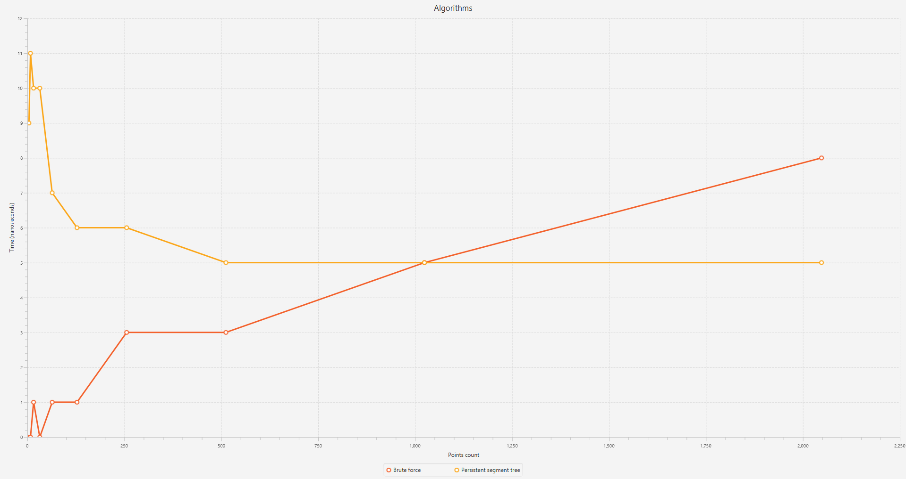
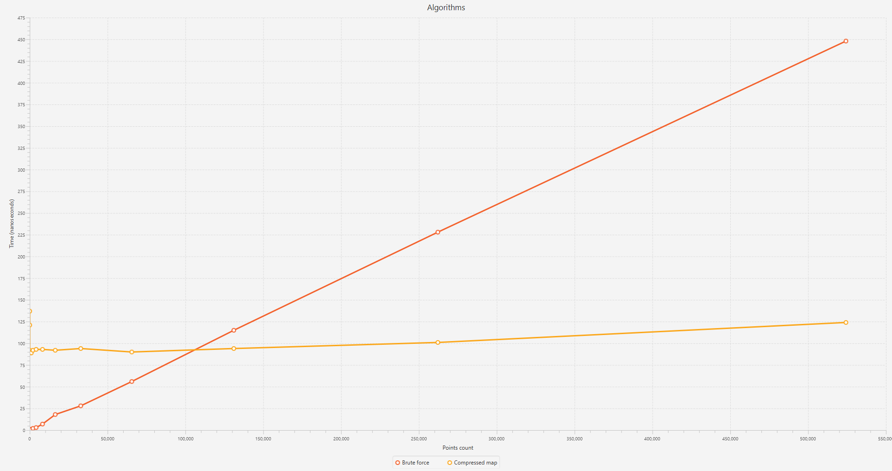
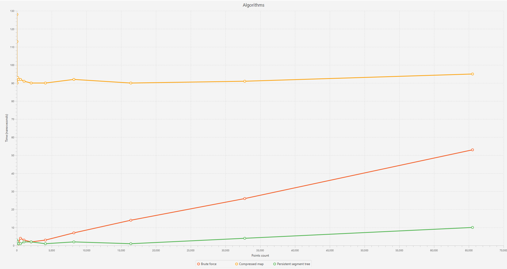
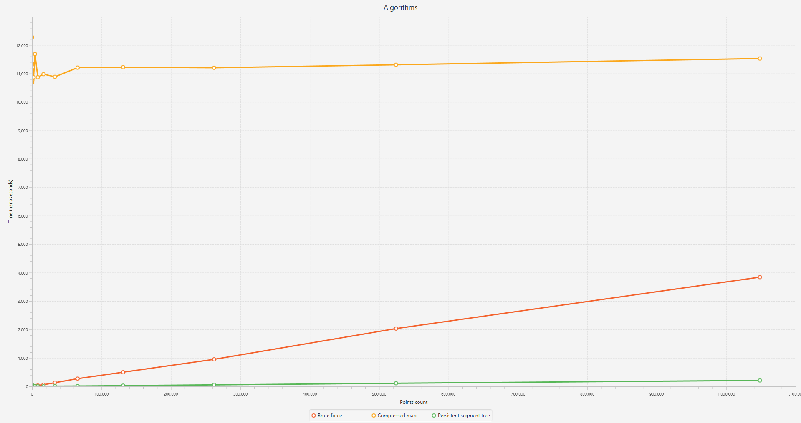
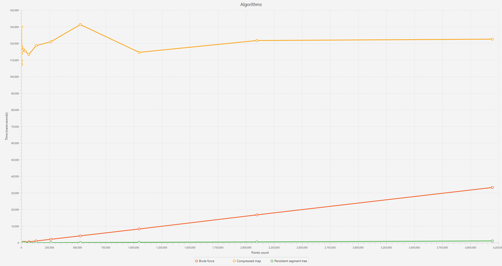

# Лабораторная работа по алгоритмам и структурам данных №2

  

<h1>Задача</h1>

На вход подается N прямоуголньников и M точек. Необходимо как можно быстрее узнать, скольким прямоуголникам каждая точка принадлежит. Тестируются следующие 3 алгоритма:

  

<h2>Алгоритм перебора (1)</h2>

Для каждой точки мы перебираем все прямоуголники, и если координаты данной точки принадлежат прямоуголнику, то увеличиваем счетчик.

  

<h3>Сложности</h3>

Сложность предподгтовки - $O(1)$</br>

Сложность поиска ответа для одной точки - $O(N)$</br>

Суммарная сложность алгоритма - $O(M \cdot N)$</br>

<h2>Алгоритм сжатия координат и построение карты (2)</h2>

Данный алгоритм подразумевает сделать предподготовку данных прежде чем сразу отвечать на вопрос для каждой точки. Во-первых, необходимо получить все уникальные координаты прямоугольников по оси ординат и абсцисс в отсортированном порядке. Имея два таких массива, мы строим двумерную матрицу, в ячейке $A[i][j]$ которой должно лежать количество прямоуголников, которые покрывают данную область. Индекс i здесь обозначает индекс в массиве уникальных значений координат по оси ординат, где $A[i]$ и $A[i + 1]$ - область, в которой мы хотим почситать количество прямоуголников. То же самое и для индекса j, только для оси абсцисс. Далее, имея такую матрицу, мы проходимся по всем точкам, и бинарным поиском ищем индекс в этих двух массивах и смотрим значение по этим индексам в построенной ранее карте.

  
<h3>Сложности</h3>

Сложность предподгтовки - $O(N^3)$</br>

Сложность поиска ответа для одной точки - $O(logN)$</br>

Суммарная сложность алгоритма - $O(N^3 + M \cdot \log N)$</br>

<h2>Алгоритм с использованием персистентного дерева отрезков (3)</h2>

Алгоритм также подразумевают предподготовку. Также необходимо получить два отсортированных массива с уникальными координатами и построить персистентное дерево отрезков. Количество листьев персистеного дерева отрезков будет равное количеству уникальных значений по оси ординат. Далее мы проходимся по прямоугольникам, одновременно формирую уникальный отсортированный массив значений по оси абсцисс и заполняя информацию, на каком значении $X$ и каких границах $Y$ прибавилось количество прямоугольников или убавилось. Далее, имея данную информацию мы строим дерево, где на отрезке $y1-y2$ прибавляем +1 или -1. Тем самым количество стейтов дерева отрезков, будет равно количеству модификация при $X$. Далее для каждой точки находим бинарным поиском нужный индекс по $x$ и по $y$, где $x$ - нужная версия персистентного дерева, а $y$ - индекс в дереве, на котором нужно найти значение.

<h3>Сложности</h3>

 Сложность подготовки - $O(N \cdot \log N)$</br>

Сложность поиска ответа для одной точки - $O(\log N)$</br>

Суммарная сложность алгоритма - $O(N \cdot \log N + M \cdot \log N)$</br>

<h1>Тестирование</h1>

<h2>Генерация прямоуголников</h2>

В тестировании будет генерироваться система вложенных друг в друга прямоуголников. Каждый следующий прямоуголник будет лежать во всех предыдущих, при этом они не будут пересекаться границами. Формула для генерации прямоуголников:

$n_i=$ { ($10 \cdot i$, $10 \cdot i$), ($10 \cdot (2N - i)$, $10 \cdot (2N - i)$) }, для $i = 0..N-1$

<h2>Генерация точек</h2>

Точки будут генерироваться следующим образом:

$x_i, y_i=(p \cdot i)^{31}$ % $(20 \cdot M)$, где p - большое простое число, разное для $x$ и $y$, $M$ - количество точек, $i=0..M-1$

<h2>Особенности тестирования</h2>

При тестировании всех трех алгоритмов их относительность друг друга не зависит от количества прямоуголников, при разном $N$, чтобы сравнить эти алгоритмы, нужно будет выбрать определенное $M$ для демонстрации преимуществ того или иного алгоритма. Поэтому в единице тестирования число прямоугольников $N$ всегда будет константно и будет зависеть только от того, как мы хотим сгенерировать точки.

Если сравнить между собой суммарную работу всех алгоритмов, то можно вывести следующие соотношения между ними:

<b>Алгоритм перебора будет эффективнее</b> алгоритма с построением карты и персистентным деревом при:

$M<\frac{N^3}{N - \log N}$ и $M<\frac{N \cdot \log N}{N - \log N}$ соответсвенно.

<b>При это алгоритм персистентного дерева будет всегда быстрее алгоритма с картой ассимптотически</b>

То есть, подбирая конкретные $M$ при фиксированном $N$, которые будут удовлетворять соотношениям сверух, можно убедиться, что при определенных условиях тот или иной алгоритм будет эффективнее другого.

Чтобы менее зависеть от процессорного времени и всяких случайных факторов компилятора и в целом компьютера, <b>количество тестов</b> для каждого алгоритма для каждого набора точек и прямоугольников будет равно <b>1000</b>, при этом в результат на графике, конечно, пойдет среднее значение всех этих результатов.

<h1>Результаты тестирования</h1>



Здесь можно посмотреть на работу алгоритмов с деревом и перебором. $N=1024$, $M=4..2048$ с шагом $M_i=M_{i-1} \cdot 2$. Как и предсказывалось из формулы, что до определенного момента перебор будет эффективнее, после чего дерево сановится гораздо эффективнее. Для $N=1024$, $M$ должно быть равно 10, после чего перебор должен проигрывать, но здесь $M$ больше, что можно объяснить отбросом константых множителей при оценке сложности, но ассимптотически все верно.  



На данном графике можно увидеть как работают относительно алгоритмы перебора и карты друг с другом. Количество прямоугольников здесь равно $N=256$, количество точек - $M=4..10^6$ с шагом $M_i=M_{i-1}\cdot 2$. Для $N=256$ перебор должен по формуле быть быстрее при $M<67000$, а далее начать проигрывать, но тут так же как и в примере выше, это число немного больше из-за неучтенных коэффициентов при ассимптотическом анализе, но так же видно, что после данного значения алгоритм с картой выигрывает перебор.

Остальные замеры алгоритмов вместе:



$N=256$, $M=4..256^2$ $M_i=M_{i-1} \cdot 2$



$N=1024$, $M=4..1024^2$ $M_i=M_{i-1} \cdot 2$



$N=2048$, $M=4..2048^2$ $M_i=M_{i-1} \cdot 2$

Как видно из результатов, алгоритм с картой работает всегда медленне, чем с деревом, что и предсказывалось по ассимптотическому анализу.

<h1>Запуск приложения</h1>

Для запуска тестов на своем компьютере, необходимо склонировать данный проект

```bash
git clone https://github.com/IlyaSekunov/algorithms-lab-2.git
```

Далее перейти в корневую папку проекта и запустить команду

```bash
./gradlew run
```

В качестве результата программа отрисует в отдельном окне графики с результатами.

<h2>Конфигурация тестирования</h2>

Для конфигурации тестирования можно перейти в файл <b>TestAlgorithm.kt</b>, где расположены глобальные константы для конфигурации:

```kotlin
TESTS_COUNT //Количество запусков для алгоритма для одного набора точек и прямоугольников

RECTANGLES_COUNT //Количество прямоугольников (N)

START_POINTS_COUNT //Стартовое значение для перебора количества точек (M)

END_POINTS_COUNT //Конечно значение для перебора количества точек (M)

STEP //Функция, возвращающая следующее значение для M на основе предыдущего значения
```